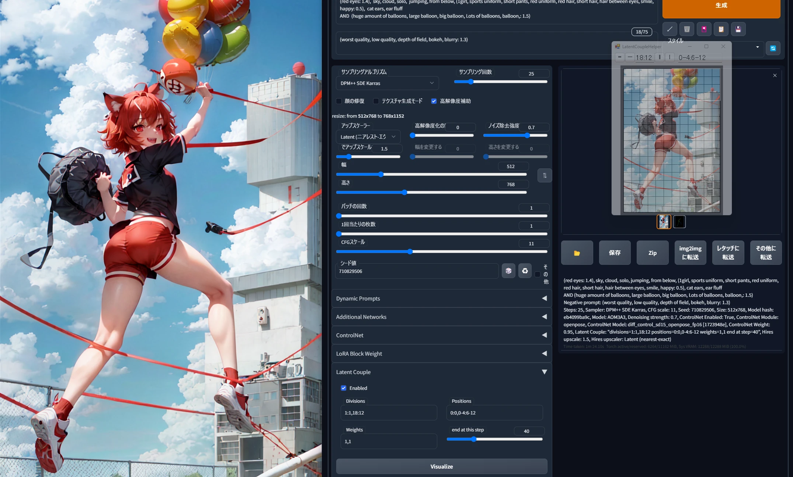
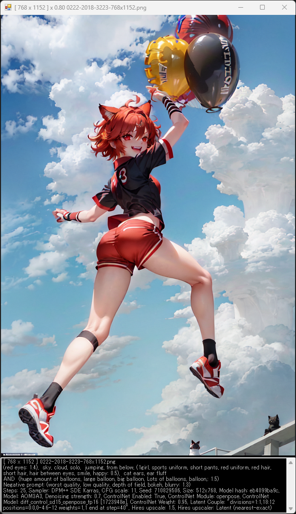

# GenImageViewer README

This tool supports English. Please translate this page in your browser.

生成画像ビューアは Stable Diffusion web UI が生成した画像を、自動で大きく表示するツールです。
キーボードの ASD キーで画像を振り分けるおまけ機能もあります。

# 使い方

Windows で GenImageViewer.bat と GenImageViewer.ps1 があれば動作します。

- GenImageViewer.bat をダブルクリックすると生成画像ビューアが立ち上がります。
	- 初回起動時に警告が表示された場合は「詳細情報」>「実行」します。 
	- 初回起動時に Stable Diffusion web UI が画像を出力するフォルダを指定してください。通常は web UI インストール先の「stable-diffusion-webui/outputs/」を選択します。
	- web UI で画像を生成すると、ウィンドウの大きさに合わせて画像を表示します。 
- マウスの左ドラッグで表示位置を移動できます。
- マウスの右クリックのコンテキストメニューから様々な操作ができます。
- マウスホイールで拡大縮小します。
- キーボードの「F」と「R」で、同じフォルダの古い画像や新しい画像を表示します。
- png 画像ファイルをドラッグ＆ドロップすると表示します。

# コンテキストメニュー

右クリックのコンテキストメニューの説明です。

- 「次へ」表示中の画像と同じフォルダにあるひとつ古い画像を表示します。キーボードの「F」キーで同じ動作をします。
- 「前へ」表示中の画像と同じフォルダにあるひとつ新しい画像を表示します。キーボードの「R」キーで同じ動作をします。
- 「ASD キーで画像振り分け」キーボードの ASD キーで画像をサブフォルダに振り分けます。スペシャルな画像を「S」に、合格の画像を「A」に、不合格の画像を「D」に振り分けたりします。フォルダにあるすべての画像を振り分けると、振り分けを終了します。振り分け先は GenImageViewer.json でフルパス指定することもできます。
- 「情報表示」ウィンドウの下部に PNG のメタ情報を表示します。
- 「ウィンドウの固定」タイトルバーを非表示にして、より画像を大きく表示します。ビューアを終了したい場合は、コンテキストメニューで「終了」します。
- 「最前面に表示」ビューアウィンドウを最前面に表示するタイミングをサブメニューで指定します。
	- 「更新で最前面」web UI で画像が生成された際に、ビューアを最前面で表示します。
	- 「常に最前面」ビューアを常に最前面で表示します。
	- 「最前面にしない」ビューアを最前面で表示しません。
- 「自動読み込み」web UI で画像が生成された画像を自動で読み込むかどうかを指定します。画像を生成しながら、他のフォルダで振り分けを実施する際などに無効にします。
- 「自動読み込みフォルダ選択」画像の生成を監視するフォルダを指定します。
- 「終了」ビューアを終了します。

## 他のツール

- [LatentCoupleHelper](https://github.com/Zuntan03/LatentCoupleHelper)
	- Latent Couple で好きな位置にプロンプトを置くためのツールです。タイトル画像の右側に表示されているツールです。
- [MaiNovel](https://github.com/Zuntan03/MaiNovel)
	- AI で生成した音声と画像で、ビジュアルノベルを作るツールです。

## ライセンス

[MIT License](./LICENSE.txt) です。

This software is released under the MIT License, see [LICENSE.txt](./LICENSE.txt).